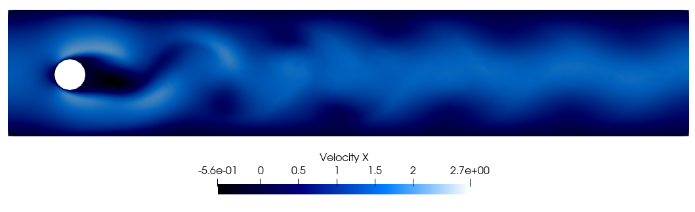

# Personal Projects
Here are my personal projects I've been working on (for fun :)). To see my published works see "publications".

### Speed running hopper with soft actor-critic and autoencoders:

### Learning smarter latent spaces for complex dynamics:

### Modeling Wake Flows with FEniCS

